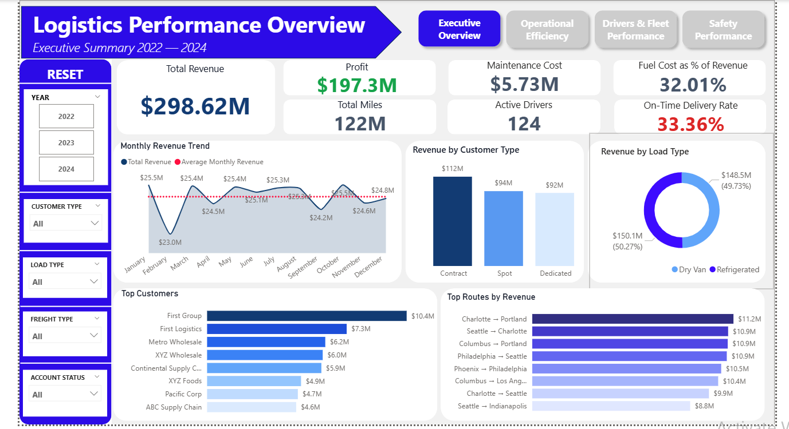
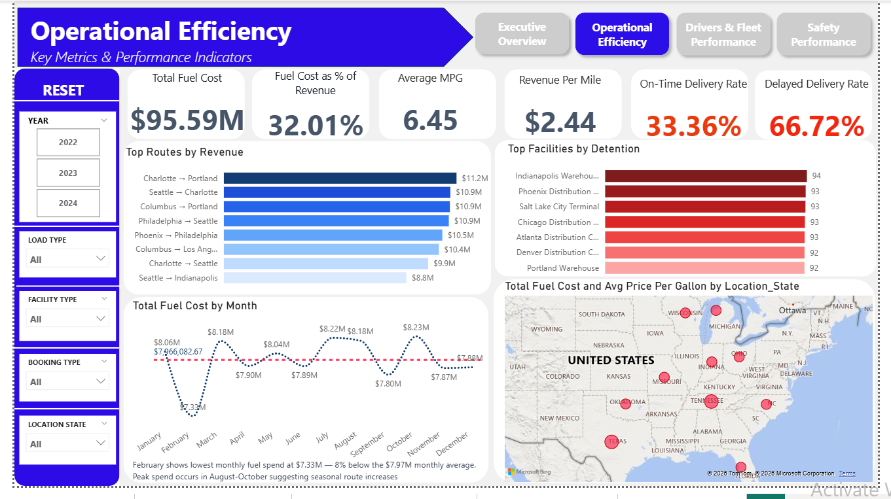
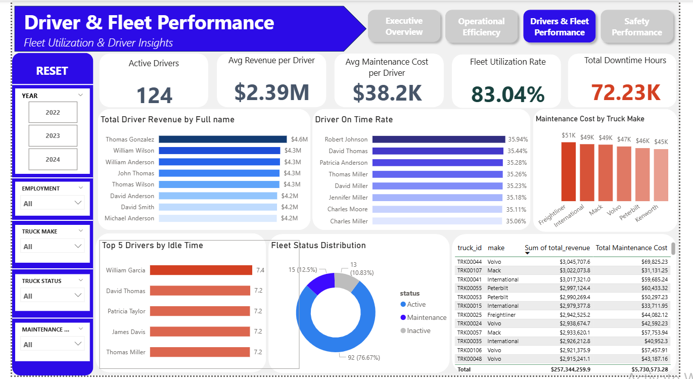
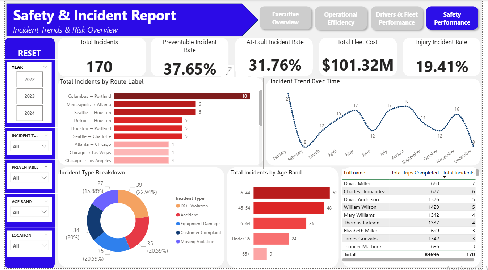
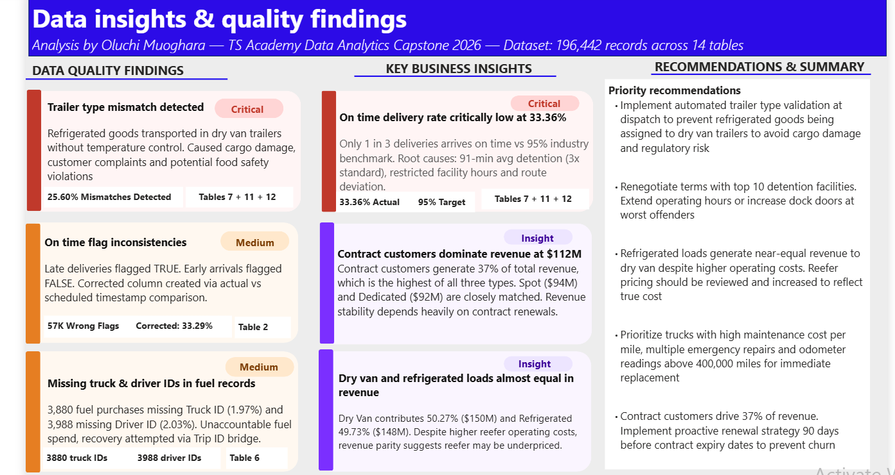

# Logistics Company Data Analytics Capstone

## Project Overview
End-to-end data analytics project analyzing a logistics 
company dataset of 196,442 records across 14 interconnected 
tables. Built as a capstone project for TS Academy Data 
Analytics program.

## Tools Used
- Power BI Desktop
- Power Query
- DAX (Data Analysis Expressions)

## Dataset
The dataset contains 14 tables covering:
- Customers
- Drivers and Driver Monthly Metrics
- Trucks and Truck Utilization
- Trailers
- Facilities
- Routes
- Loads
- Trips
- Delivery Events
- Fuel Purchase
- Maintenance Records
- Safety Incidents

## Dashboard Pages

### 1. Executive Overview
Revenue, trips completed, on time rate and fleet utilization summary.

### 2. Operational Efficiency
Fuel costs, route performance and facility detention analysis.

### 3. Driver and Fleet Performance
Driver revenue, fleet health and maintenance cost analysis.

### 4. Safety Performance
Incidents, violations, cargo damage and safety trends.

### 5. Data Insights
Key findings, data quality issues and business recommendations.

## Key Findings
- On time delivery rate of 33.36% — critically below 95% industry standard
- Trailer type mismatches identified — refrigerated goods transported in dry van trailers
- Average facility detention of 91 minutes — 3x above the 30 minute industry standard
- Fuel cost at 32% of revenue — above the 28% industry benchmark
- 3,880 fuel purchase records missing Truck ID and 3,988 missing Driver ID

## Data Quality Issues Found
| Finding | Severity | Records Affected |
|---|---|---|
| Trailer type mismatch | Critical | X trips |
| On time flag errors | Medium | X records |
| Missing fuel purchase IDs | Medium | 7,868 records |
| Facility ID integrity | Positive | 50/50 matched |

## How to View
1. Download the .pbix file from this repository
2. Open with Power BI Desktop (free download from Microsoft)
3. Navigate through the 5 dashboard pages using the navigation buttons

## About
Built by Oluchi Muoghara as part of the TS Academy Data Analytics 
capstone program — 2026.

Connect with me on LinkedIn: https://www.linkedin.com/in/oluchi-muoghara-9846b4254
